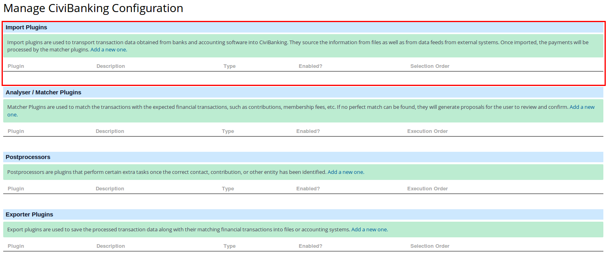

## Introduction

Configuring CiviBanking is a bit of a job. As it is pretty powerful and can
handle different types of files, it also needs configuration for each file. And
as you are importing files from specific formats it also requires quite some
technical knowledge to understand all the steps required.

!!! note "What if I want to know more?"
    Please note that this chapter does not mention all possibilities or options.
    CiviBanking is very powerful and flexible, trying to write a guide that
    mentions all possibilities would be a massive task. The amibition of this
    section is to give you an example configuration and explain the concepts. If
    you have specific needs or additional questions please contact an expert to
    discuss what is possible? It might well be that you have read this chapter
    and think this is a far too daunting step for you to take. If that is the
    case, please contact a CiviCRM expert to help you. You can find CiviCRM
    experts on the Find an Expert page on the
    [CiviCRM website](https://civicrm.org/partners-contributors).

Technically speaking there are 3 steps in the CiviBanking process when reading
and processing payments:

1. Importing
1. Analyzing
1. Matching

The **first step (importing)** is translating the data from the original format
to the basic generic format that CiviBanking understands. It is a bit as if
CiviBanking can understand Esperanto, and can do all the following steps as long
as the data is in Esperanto. The **importing** step will translate the dialect
of your bank or other payment service into the CiviBanking Esperanto.

The **second step (analyzing)** reads the transaction from the payments file and
checks what it could find and do related to your CiviCRM installation. For
example:

* the payment could be linked to a certain contribution (will be the most common
  case)
* no contribution but there is a contact with the same name and bank account,
  and a new contribution could be created
* no contribution but there is a contact with the same name but no bank account,
  and a new contribution could be created
* the payment has nothing to do with CiviCRM
* etc. etc.

In the **third step (matching)** you pick one of the suggestions from the
analyzing step and process that into CiviCRM (or configure the matcher to do so
automatically).

We will look into each step in some more detail in the following sections from a
configuration point of view.

For this documentation section we assume you have accepted all the defaults in
the CiviBanking Settings! There will be more detail about the CiviBanking
settings in the [User Guide](../user-guide.md).

## Examples

After you read this document, it's probably a good ida to have a look at the
example configurations in our
[Configuration Example Database](https://github.com/Project60/org.project60.banking/tree/master/configuration_database)
.

## Importing

As explained, **importing** is about translating the data provided by the
payment processor (bank files, csv files etc.) into the CiviBanking speak.

There can be many files containing payments that you would like to have
processed like:

* the payment transactions in your bank account that you can get from the bank
* credit card payments that you get from the credit card company
* PayPal payments which you can download from the PayPal website
* SMS payments that you can get from your SMS provider
* etc. etc.

You will need to configure so called Importer Plugins in CiviBanking for each
type of file you want to import. In this section we will discuss how to do this
for:

* the payments transactions you get from the bank in CAMT53 format (a format
  used by a lot of Western European Banks)
* an SMS payments file in CSV format.

An _importer plugin_ can be installed or imported from **Banking>Configuration
Manager**. The first time you access the Configuration Manager you will probably
get a form like this:

Alternatively, if I have a configuration (including importers, matchers and so
on) for CiviBanking from another CiviCRM installation, I can use the **
IMPORTER** link to select an exported configuration file and import that into my
new CiviBanking installation. For this section we will assume you are going to
create a new one, so I have clicked on the **add a new one** link.



In this case we are interested in adding a _plugin_ to import, so the top part.
As you can see there are no plugins configured just yet, so I will click the **
Add a new one** link in the **Import plugins** section of the form. In the
specific sections for the importers you will see examples of how this is
continued.

### CAMT53 file

!!! warning
    Unfortunately different banks have slightly different formats which makes it
    complicated to give one example of a configuration that will work. In my
    example installation using the standard CAMT053 format works, but if I try
    to process a file from some specific banks it does not work.
    If you get a CAMT053 file from your bank and you find it that you can not
    process (you get an error _File rejected by importer!_) the best option is
    to contact an expert that can help you in adapting the importer for the
    specific format of your bank!

As mentioned above I have clicked the **add a new one** link in the **Banking>
Configuration Manager** page. In the next form I enter a _name_ for the plugin,
I select the **Import Plugin** as the _class_. As CAMT53 is a type of XML file I
select **Configurable XML importer** as _Implementation_. And I enter a few
sentences describing what the imported does at _description_. The result will be
in the top half of the Configuration Manager Add Plugin screen and will look
something like this screenshot:


In the bottom half I have to enter the technical information required to
interpret the incoming file and know which field in the incoming file to send to
which field in the CiviBanking transaction.

This kind of information is entered in [JSON](https://www.json.org/). For the
CAMT53 we have an example configuration (from a project where this worked for
their BNP Paribas Fortis bank file) which might well (and really should) work
for your bank files too.

You can copy the JSON data below and paste it in the bottom half of the
Configuration Manager Add Plugin form (the part marked with **Configuration**).
Once all the data is entered press the **Save** button to save your plugin
configuration.

If you want to know more about the configuration of an importer and how you can
create your specific importer please
check [How to create an importer](create-importer.md).

``` json
{
  "comment": "CAMT.53 Import configuration (BNP Paribas Fortis)",
  "defaults": {
    "payment_instrument_id": "9" 
  },
  "namespaces": {
    "camt": "urn:iso:std:iso:20022:tech:xsd:camt.053.001.02" 
  },
  "probe": "camt:BkToCstmrStmt/camt:GrpHdr/camt:MsgId",
  "rules": [
    {
      "comment": "statement name is MsgId/LglSeqNb",
      "from": "xpath:camt:BkToCstmrStmt/camt:GrpHdr/camt:MsgId",
      "to": "tx_batch.reference",
      "type": "set" 
    },
    {
      "comment": "IBAN preset for payments",
      "from": "xpath:camt:BkToCstmrStmt/camt:Stmt/camt:Acct/camt:Id/camt:IBAN",
      "to": "tx._IBAN",
      "type": "set" 
    },
    {
      "comment": "BIC preset for payments",
      "from": "xpath:camt:BkToCstmrStmt/camt:Stmt/camt:Acct/camt:Svcr/camt:FinInstnId/camt:BIC",
      "to": "tx._BIC",
      "type": "set" 
    },
    {
      "comment": "starting time",
      "from": "xpath:camt:BkToCstmrStmt/camt:Stmt/camt:Bal[2]/camt:Dt/camt:Dt",
      "to": "tx_batch.starting_date",
      "type": "strtotime" 
    },
    {
      "comment": "ending time",
      "from": "xpath:camt:BkToCstmrStmt/camt:Stmt/camt:Bal[2]/camt:Dt/camt:Dt",
      "to": "tx_batch.ending_date",
      "type": "strtotime" 
    },
    {
      "comment": "statement currency",
      "from": "xpath:camt:BkToCstmrStmt/camt:Stmt/camt:Bal[1]/camt:Amt/@Ccy",
      "to": "tx_batch.currency",
      "type": "set" 
    },
    {
      "comment": "statement starting balance. FIXME: include condition instead of position",
      "from": "xpath:camt:BkToCstmrStmt/camt:Stmt/camt:Bal[2]/camt:Amt",
      "to": "tx_batch.starting_balance",
      "type": "amount" 
    },
    {
      "comment": "statement starting balance. FIXME: include condition instead of position",
      "from": "xpath:camt:BkToCstmrStmt/camt:Stmt/camt:Bal[1]/camt:Amt",
      "to": "tx_batch.ending_balance",
      "type": "amount" 
    }
  ],
  "payment_lines": [
    {
      "comment": "general lines will be imported per-entry",
      "path": "camt:BkToCstmrStmt/camt:Stmt/camt:Ntry",
      "filter": "not_exists:camt:NtryDtls/camt:Btch",
      "rules": [
        {
          "comment": "booking date",
          "from": "xpath:camt:BookgDt/camt:Dt",
          "to": "booking_date",
          "type": "strtotime" 
        },
        {
          "comment": "value date (AI asked us to use the booking date for both)",
          "from": "xpath:camt:BookgDt/camt:Dt",
          "to": "value_date",
          "type": "strtotime" 
        },
        {
          "comment": "Amount debit/credit",
          "from": "xpath:camt:CdtDbtInd",
          "to": "amount",
          "type": "set" 
        },
        {
          "comment": "Amount",
          "from": "xpath:camt:Amt",
          "to": "amount",
          "type": "append:" 
        },
        {
          "comment": "CRDT means positive (omit +)",
          "to": "amount",
          "from": "amount",
          "type": "replace:CRDT:" 
        },
        {
          "comment": "DBIT means negative",
          "from": "amount",
          "to": "amount",
          "type": "replace:DBIT:-" 
        },
        {
          "comment": "Currency",
          "from": "xpath:camt:Amt/@Ccy",
          "to": "currency",
          "type": "set" 
        },
        {
          "comment": "party IBAN",
          "from": "xpath:camt:NtryDtls/camt:TxDtls/camt:RltdPties/camt:CdtrAcct/camt:Id/camt:IBAN|camt:NtryDtls/camt:TxDtls/camt:RltdPties/camt:DbtrAcct/camt:Id/camt:IBAN",
          "to": "_party_IBAN",
          "type": "set" 
        },
        {
          "comment": "party BIC",
          "from": "xpath:camt:NtryDtls/camt:TxDtls/camt:RltdAgts/camt:CdtrAgt/camt:FinInstnId/camt:BIC|camt:NtryDtls/camt:TxDtls/camt:RltdAgts/camt:DbtrAgt/camt:FinInstnId/camt:BIC",
          "to": "_party_BIC",
          "type": "set" 
        },
        {
          "comment": "transaction message",
          "from": "xpath:camt:NtryDtls/camt:TxDtls/camt:RmtInf/camt:Ustrd",
          "to": "purpose",
          "type": "set" 
        },
        {
          "comment": "party name",
          "from": "xpath:camt:NtryDtls/camt:TxDtls/camt:RltdPties/camt:Cdtr/camt:Nm|camt:NtryDtls/camt:TxDtls/camt:RltdPties/camt:Dbtr/camt:Nm",
          "to": "name",
          "type": "set" 
        },
        {
          "comment": "party address",
          "from": "xpath:camt:NtryDtls/camt:TxDtls/camt:RltdPties/camt:Cdtr/camt:PstlAdr/camt:AdrLine[1]|camt:NtryDtls/camt:TxDtls/camt:RltdPties/camt:Dbtr/camt:PstlAdr/camt:AdrLine[1]",
          "to": "street_address",
          "type": "set" 
        },
        {
          "comment": "party address",
          "from": "xpath:camt:NtryDtls/camt:TxDtls/camt:RltdPties/camt:Cdtr/camt:PstlAdr/camt:AdrLine[2]|camt:NtryDtls/camt:TxDtls/camt:RltdPties/camt:Dbtr/camt:PstlAdr/camt:AdrLine[2]",
          "to": "postal_code",
          "type": "regex:#^(\\d{4}\\s+\\w{2}) +\\w+#" 
        },
        {
          "comment": "party address",
          "from": "xpath:camt:NtryDtls/camt:TxDtls/camt:RltdPties/camt:Cdtr/camt:PstlAdr/camt:AdrLine[2]|camt:NtryDtls/camt:TxDtls/camt:RltdPties/camt:Dbtr/camt:PstlAdr/camt:AdrLine[2]",
          "to": "city",
          "type": "regex:#^\\d{4}\\s+\\w{2} +(\\w.+) *$#" 
        }
      ]
    },
    {
      "comment": "batch entries will be expanded",
      "path": "camt:BkToCstmrStmt/camt:Stmt/camt:Ntry/camt:NtryDtls/camt:TxDtls",
      "filter": "exists:../camt:Btch",
      "rules": [
        {
          "comment": "booking date",
          "from": "xpath:../../camt:BookgDt/camt:Dt",
          "to": "booking_date",
          "type": "strtotime" 
        },
        {
          "comment": "value date (AI asked us to use the booking date for both)",
          "from": "xpath:../../camt:BookgDt/camt:Dt",
          "to": "value_date",
          "type": "strtotime" 
        },
        {
          "comment": "Amount debit/credit",
          "from": "xpath:../../camt:CdtDbtInd",
          "to": "amount",
          "type": "set" 
        },
        {
          "comment": "parse/normalise amount",
          "from": "xpath:camt:AmtDtls/camt:TxAmt/camt:Amt",
          "to": "amount_parsed",
          "type": "amount" 
        },
        {
          "comment": "append parsed amount",
          "from": "amount_parsed",
          "to": "amount",
          "type": "append:" 
        },
        {
          "comment": "CRDT means positive (omit +)",
          "to": "amount",
          "from": "amount",
          "type": "replace:CRDT:" 
        },
        {
          "comment": "DBIT means negative",
          "from": "amount",
          "to": "amount",
          "type": "replace:DBIT:-" 
        },
        {
          "comment": "Currency",
          "from": "xpath:camt:AmtDtls/camt:TxAmt/camt:Amt/@Ccy",
          "to": "currency",
          "type": "set" 
        },
        {
          "comment": "party IBAN",
          "from": "xpath:camt:RltdPties/camt:DbtrAcct/camt:Id/camt:IBAN|camt:RltdPties/camt:CdtrAcct/camt:Id/camt:IBAN",
          "to": "_party_IBAN",
          "type": "set" 
        },
        {
          "comment": "party BIC",
          "from": "xpath:camt:RltdAgts/camt:DbtrAgt/camt:FinInstnId/camt:BIC|RltdAgts/camt:CdtrAgt/camt:FinInstnId/camt:BIC",
          "to": "_party_BIC",
          "type": "set" 
        },
        {
          "comment": "transaction message",
          "from": "xpath:camt:AddtlTxInf",
          "to": "purpose",
          "type": "set" 
        },
        {
          "comment": "party name",
          "from": "xpath:camt:RltdPties/camt:Cdtr/camt:Nm",
          "to": "name",
          "type": "set" 
        },
        {
          "comment": "party address",
          "from": "xpath:camt:RltdPties/camt:Dbtr/camt:PstlAdr/camt:AdrLine[1]|camt:RltdPties/camt:Cdtr/camt:PstlAdr/camt:AdrLine[1]",
          "to": "street_address",
          "type": "set" 
        },
        {
          "comment": "party address",
          "from": "xpath:camt:RltdPties/camt:Dbtr/camt:PstlAdr/camt:AdrLine[2]|camt:RltdPties/camt:Cdtr/camt:PstlAdr/camt:AdrLine[2]",
          "to": "postal_code",
          "type": "regex:#^(\\d{4}) +\\w+#" 
        },
        {
          "comment": "party address",
          "from": "xpath:camt:RltdPties/camt:Dbtr/camt:PstlAdr/camt:AdrLine[2]|camt:RltdPties/camt:Cdtr/camt:PstlAdr/camt:AdrLine[2]",
          "to": "city",
          "type": "regex:#^\\d{4} +(\\w.+) *$#" 
        },
        {
          "comment": "SEPA mandate reference",
          "from": "xpath:camt:Refs/camt:MndtId",
          "to": "sepa_mandate",
          "type": "set" 
        },
        {
          "comment": "SEPA status code",
          "from": "xpath:camt:RtrInf/camt:Rsn/camt:Cd",
          "to": "sepa_code",
          "type": "set" 
        }
      ]
    }
  ]
}
```

!!! note
    The _payment_instrument_id_ is really important and should be
    configured correctly. This means that the ID should exists in your database
    and reflect the payment instrument you want to use for the incoming
    transactions, for example Bank Transfer.

Once you have completed the configuration of your CAMT53 importer you should
test if it actually works!

You can do this by importing a file with **Banking/Import Transactions**.
Selecting this from the menu will bring up a form like the screenshot:


You can see I have select **CAMT53** as the _configuration_. I have also set
the _Dry run_ option to **Yes** so it does not actually import the file I am
about to select, but just tells me if it _could_ import the file. I then click
on **Browse** to select the CAMT53 file I want to test with.

### CSV format

As mentioned above I have clicked the **add a new one** link in the **Banking>
Configuration Manager** page. In the next form I enter a _name_ for the plugin,
I select the **Import Plugin** as the _class_. The example importer I am going
to show is meant to import SMS payments from a CSV file so I select **
Configurable CSV importer** as _Implementation_. And I enter a few sentences
describing what the imported does at _description_. The result will be in the
top half of the Configuration Manager Add Plugin screen and will look something
like this screenshot:


In the bottom half I have to enter the technical information required to
interpret the incoming file and know which field in the incoming file to send to
which field in the CiviBanking transaction.

This kind of information is entered in [JSON](https://www.json.org/). For the
CSV we have an example configuration (from a project where this worked for their
SMS payments which they download as a CSV file which should serve as an example.

You can copy the JSON data below and paste it in the bottom half of the
Configuration Manager Add Plugin form (the part marked with **Configuration**).
Once all the data is entered press the **Save** button to save your plugin
configuration.

``` json
{
  "delimiter": ";",
  "header": 1,
  "title": "SMS {starting_date} - {ending_date}",
  "defaults": {
    "sms_contact_id": 2314,
    "financial_type_id": 1,
    "payment_instrument_id": 7
  },
  "line_filter": "#(Bedankt voor jouw donatie aan Stichting Voorbeeld)|(\"Status\",Direction,Processed.*)#",
  "filter": [
    {
      "type": "string_positive",
      "value1": "_constant:Delivered",
      "value2": 0
    }
  ],
  "rules": [
    {
      "from": "Processed",
      "to": "booking_date",
      "type": "set"
    },
    {
      "from": "Processed",
      "to": "value_date",
      "type": "set"
    },
    {
      "from": "Message",
      "to": "purpose",
      "type": "set"
    },
    {
      "from": "Cost",
      "to": "amount",
      "type": "replace:€ :"
    },
    {
      "from": "amount",
      "to": "amount",
      "type": "amount"
    }
  ]
}
```

If you want to know more about the configuration of an importer and how you can
create your specific importer please
check [How to create an importer](create-importer.md).

!!! note
    The _payment_instrument_id_ is really important and should be configured
    correctly. This means that the ID should exists in your database and reflect
    the payment instrument you want to use for the incoming transactions, for
    example SMS payment.

Once you have completed the configuration of your CSV importer you should test
if it actually works!

You can do this by importing a file with **Banking/Import Transactions**.
Selecting this from the menu will bring up a form like the screenshot:


You can see I have select **SMS Payments from CSV file** as the _configuration_.
I have also set the _Dry run_ option to **Yes** so it does not actually import
the file I am about to select, but just tells me if it _could_ import the file.
I then click on **Browse** (or _Bladeren_ in my Dutch installation) to select
the .csv file I want to test with.

## Analyzing (and Matching)

The process of analyzing tries to interpret and enrich the imported data to be
able to do suggestion what should be done in the data.

Quite an abstract description, but if I make it a little more pragmatic:
analyzing could be checking if there is a IBAN (International Bank Account
Number) in the data and if so, use that to match it with a contact in CiviRM
that has that IBAN registered.

To be able to do that you will need to configure _Analyser_ and _Matcher
Plugins_. These are configurable parts that tell CiviBanking how to analyse part
of the data, or how to match the transaction. It could also tell CiviBanking to
ignore certain transactions etc. All these kind of plugins will have the **
plugin class** Matcher and different **Implementations** doing things like
analysing, matching or ignoring.

A configuration of CiviBanking will have some of these by default, but during
the implementation process you will probably need to configure a few more.

In the subsections below I will explain what the different **implementations**
are and mean, and give you some examples of some of the implementations. This
should give you a first idea of what is required. If you want to know more about
creating your own plugins of the **Matcher** class, check the
section [How to create a matcher](create-matcher.md).

### Implementation Types

Here is a comprehensive list of the different implementation types of
Matcher/Analyser Plugins with a short sentence on what they can do. In the
subsections you will see some examples of the ones that are most commonly used.

* **Default Options Matcher Plugin** - this plugin will be installed by default
  and provide the default suggestions _process manually_ or _ignore in CiviCRM_
* **Create Contribution Matcher Plugin** - a plugin that will create a
  contribution based on specific matches
* **Contribution Matcher** - a plugin that will try to find a pending
  contribution matching the payment and set it to completed
* **Recurring Contribution Matcher Plugin** - a plugin that will try to find a
  recurring contribution for the payment and create an installment (a linked
  completed contribution)
* **SEPA Matcher** - a plugin that will try to find a SEPA mandate and record
  the payment as installment (find a pending contribution and set it to
  completed)
* **Membership Matcher Plugin** - a plugin that will try to find a membership
  and record the payment as a membership payment for this membership
* **Ignore Matcher** - a matcher that will ignore payments that match the
  criteria (for payments that do not have to be in CiviCRM)
* **Batch Matcher** - a matcher that will try to find the financial batch in
  CiviCRM and (if it is one big payment) distribute it over the entities in the
  batch. At least, that is the theory, we know of no installation that uses this
  plugin.
* **RegEx Analyser** - this plugin will try to find a certain pattern specified
  in a Regular Expression (
  check [here](https://en.wikipedia.org/wiki/Regular_expression)) for more about
  Regular Expressions) and is then able to do something or enrich the data of
  the transaction
* **Account Lookup Analyser** - this plugin will be switched on by default and
  enables a match based on bank account
* **Dummy Matcher Test Plugin** - is there for testing purposes, not really
  usable in real life

#### Regex Analyser Plugin example

For example, an _Analyser Plugin_ might check in the imported data if the
field **name** contains something like _MOLLIE_ or _mollie_, the financial type
should be set to a certain value.

The _analyser plugin_ will have configuration details to specify the _regular
expression_ to look for (more information on Regular
Expressions [here](https://en.wikipedia.org/wiki/Regular_expression)) and how to
enrich the transaction data with the correct financial type.

#### Contribution Matcher Plugin example

#### Create Contribution Matcher Plugin example

#### Recurring Contribution Matcher Plugin

#### SEPA Matcher Plugin example

#### Ignore Plugin example 
