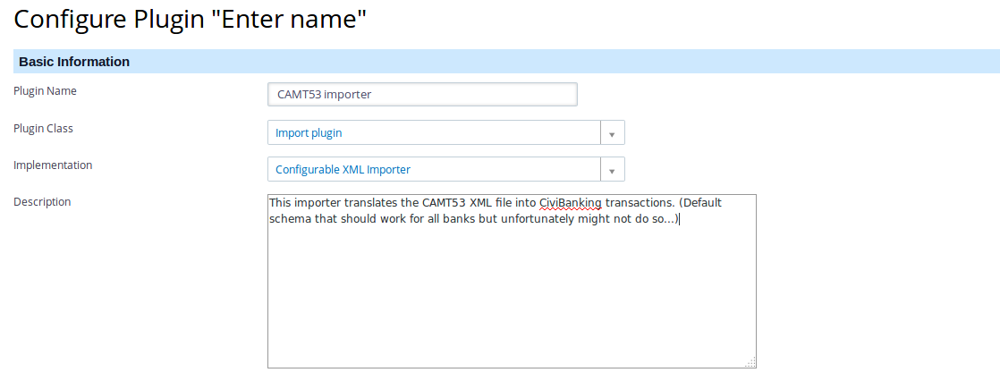

We'll start off by creating a new importer based on XML structure so that we can
import our demo banking file based on the format CAMT53. As mentioned above,
having clicked the **add a new one** link in the **Configuration Manager** page,
in the next form you will have to enter a _name_ for the plugin, select the **
Import Plugin** as the _class_, and enter a few sentences describing what the
importer does at _description_. The result will be in the top half of the
Configuration Manager Add Plugin screen and will look something like this
screenshot:



!!! warning
    Unfortunately different banks have slightly different formats which makes it
    complicated to give one example of a configuration that will work. In my
    example installation using the standard CAMT.053 format works, but if I try
    to process a file from some specific banks it does not work.
    If you get a CAMT.053 file from your bank and you find that you can not
    process (you get an error _File rejected by importer!_) the best option is
    to contact an expert that can help you in adapting the importer for the
    specific format of your bank!

As mentioned before, there are a handful of variables that have special weight
in the CiviBanking ecosystem. Those are:

* `booking_date`
* `value_date`
* `amount`
* `currency`

Those variables are considered mandatory and need to be defined in our importer
rule.

Lastly, it's important to mention that all rules must be written in valid JSON
format.

## Opening / generic elements

```json
{
  "comment": "CAMT.53 Import configuration (BNP Paribas Fortis)",
  "defaults": {
    "payment_instrument_id": "4" 
  },
  "namespaces": {
    "camt": "urn:iso:std:iso:20022:tech:xsd:camt.053.001.02" 
  },
  "probe": "camt:BkToCstmrStmt/camt:GrpHdr/camt:MsgId",
```

### Comments

We start of by adding a comment so that it will make our lives easier in case we have many importers at a later stage. Note: Comment tags are always *optional*.

### Defaults

The group **Defaults** is used to enclose definitions for some standard piece of information about the incoming transactions that will be added to **all** the upcoming transactions of the file that we will be importing.

In this example, we specify that by default the attribute of **payment_instrument_id** will always be the number '4' (unless we alter it during the matcher chapter)

!!! note
    The _payment_instrument_id_ is really important and should be configured
    correctly. This means that the ID should exist in your database and reflect
    the payment instrument you want to use for the incoming transactions, for
    example Bank Transfer.

### Namespaces

Namespace is a mechanism to avoid name conflicts by differentiating elements or attributes within an XML document that may have identical names, but different definitions.

In our example, we're defining that our structure will start to be read from the namespace `urn:iso:std:iso:20022:tech:xsd:camt.053.001.02`

### Probe

The Probe attribute, although it's considered *optional*, is mainly used as a validator for the XML file that you are importing. If and when specified, it's like asking CiviBanking: Does the file that I am currently importing has this line ? If yes, it's valid and proceed to the rules. If no, discard and return. In this specific example, since we present the 'probe' attribute, we specify that we're looking for the string: `camt:BkToCstmrStmt/camt:GrpHdr/camt:MsgId` . If that string is identified, importer will proceed.

## Rules / Subrules (set of actions)

Rules are the actual part that starts to do the element assignment based on what they 'see' inside the transaction file while importation takes place. They start by definining the attribute 'rules':

```json
"rules": [
]
```

## payment_lines

```json
"payment_lines": [
 ]
```

Attribute '*payment_lines*' holds a set of actions that are required during the
import. We'll be displaying a few actions in our examples but for a complete
list of actions that are available per importer, please
see [XML Importer Actions](#list-of-supported-actions).

```json
    {
      "comment": "statement name is MsgId/LglSeqNb",
      "from": "xpath:camt:BkToCstmrStmt/camt:GrpHdr/camt:MsgId",
      "to": "tx.reference",
      "type": "set" 
    },
```

### set (action)

In the paragraph above, we used the comment attribute to give a human readable description as to what this ruleset will do. The most commonly used action is **set**. This action has the following possible parameters/options:

* "from": Defines which element from the XML Path OR variable to read so that it can find the variable. if our definition (like in this example) is starting with `xpath` then we're directing the importer to find that XPATH instead of a variable.
* "to": Once we get this variable, we need to define where to store it. This is the reason that we use the "to" element. In our example we will be storing it in the variable **"reference"** of the entity/namespace **tx_batch**.

---

```json
    {
      "comment": "IBAN preset for payments",
      "from": "xpath:camt:BkToCstmrStmt/camt:Stmt/camt:Acct/camt:Id/camt:IBAN",
      "to": "tx._IBAN",
      "type": "set" 
    },
```

In the above example, we are trying to fetch the IBAN that is stored in the XML Path `camt:BkToCstmrStmt/camt:Stmt/camt:Acct/camt:Id/camt:IBAN` by using the "set" action and we will be storing it in the **tx** namespace (variable name is **_IBAN**)

---

```json
    {
      "comment": "statement currency",
      "from": "xpath:camt:BkToCstmrStmt/camt:Stmt/camt:Bal[1]/camt:Amt/@Ccy",
      "to": "tx.currency",
      "type": "set" 
    },
```

In this example, we'll using again the action "set" to fetch the currency of the transaction from the XML path `camt:BkToCstmrStmt/camt:Stmt/camt:Bal[1]/camt:Amt/@Ccy` and store it in the **currency** variable (Namespace: tx) .

---

```json
        {
          "comment": "party IBAN",
          "from": "xpath:camt:RltdPties/camt:DbtrAcct/camt:Id/camt:IBAN|camt:RltdPties/camt:CdtrAcct/camt:Id/camt:IBAN",
          "to": "_party_IBAN",
          "type": "set" 
        },

```

In this example, we'll using again the action "set" to fetch the party's IBAN (sender's IBAN) from the XML path `xpath:camt:RltdPties/camt:DbtrAcct/camt:Id/camt:IBAN|camt:RltdPties/camt:CdtrAcct/camt:Id/camt:IBAN` and store it in the **_party_IBAN** variable (Namespace: tx).

Note: This variable is one of the few that were referred [here](# Overview - XML Importer)

For a comprehensive list of actions, please read [here](#list-of-supported-actions).

---

### amount (action)

```json
    {
      "comment": "statement starting balance. FIXME: include condition instead of position",
      "from": "xpath:camt:BkToCstmrStmt/camt:Stmt/camt:Bal[2]/camt:Amt",
      "to": "amount",
      "type": "amount" 
    },
```

Although a little bit similar to the **set** action, amount is used when we know that our variable is an amount. The difference is that there are special formatters being used so that it can treat properly the thousands/decimals separators.

Similarly to the set action, we're looking for the amount from the XML path `camt:BkToCstmrStmt/camt:Stmt/camt:Bal[2]/camt:Amt` and we're storing it to the variable **amount** (Namespace: tx).

This action has the following possible parameters/options:

- "from": Defines which element from the XML Path OR variable to read so that it can find the variable. if our definition (like in this example) is starting with `xpath` then we're directing the importer to find that XPATH instead of a variable.
- "to": Once we get this variable, we need to define where to store it. This is the reason that we use the "to" element.

For a comprehensive list of actions, please read [here](#list-of-supported-actions).

### strtotime (action)

```json
        {
          "comment": "booking date",
          "from": "xpath:camt:BookgDt/camt:Dt",
          "to": "booking_date",
          "type": "strtotime" 
        },
```

Dates have their own action, called "strtotime". Similar to the set action, they also require 2 parameters to work:

* "from": Defines which element from the XML Path to read so that it can find the variable.
* "to": Once we get this variable, we need to define where to store it. This is the reason that we use the "to" element.

---

```json
    {
      "comment": "value date",
      "from": "xpath:camt:BookgDt/camt:Dt",
      "to": "value_date",
      "type": "strtotime" 
    },
```
As discussed on the general documentation file but also at the start of this documentation, value_date and booking_date are a few from the minimum parameters required from civibanking to work properly.

Similarly, we're using the `strtotime` action to populate this variable.

For a comprehensive list of actions, please read [here](#list-of-supported-actions).

### replace (action)

```json
        {
          "comment": "DBIT means negative",
          "from": "amount",
          "to": "amount",
          "type": "replace:DBIT:-" 
        },
```

Replace action is doing an in-place replacement of a string into another string. The source string is specified directly after the `replace` string. The replacement string is specified directly after the source string. Detailed parameters:

- "from": Defines which element from the XML Path OR variable to read so that it can find the variable. if our definition (like in this example) is **not** starting with an `xpath` string, then we're directing the importer to find that variable in the transaction entry.
- "to": Once we get this variable, we need to define where to store it. This is the reason that we use the "to" element.
- "type": replace:<source_string>:<target_string>

In this specific example, we request that the importer will find the variable in the variable named `amount` inside the imported set and replace the word `DBIT` with `-`.

For a comprehensive list of actions, please read [here](#list-of-supported-actions).

### regex (action)

```json
        {
          "comment": "party address",
          "from": "xpath:camt:RltdPties/camt:Dbtr/camt:PstlAdr/camt:AdrLine[2]|camt:RltdPties/camt:Cdtr/camt:PstlAdr/camt:AdrLine[2]",
          "to": "postal_code",
          "type": "regex:#^(\\d{4}) +\\w+#" 
        },
```

Similar to the `set` action, the `regex` action does what it exactly implies: Using a regular expression, it extracts the piece of information that was requested.

Detailed parameters:

- "from": Defines which element from the XML Path OR variable to read so that it can find the variable. if our definition (like in this example) is  starting with an `xpath` string, then we're directing the importer to find that variable inside the specified XPATH.
- "to": Once we get this variable, we need to define where to store it. This is the reason that we use the "to" element.
- "type": `regex:<regex_expression>`

What our snippet does exactly: Read variable from XPATH `xpath:camt:RltdPties/camt:Dbtr/camt:PstlAdr/camt:AdrLine[2]|camt:RltdPties/camt:Cdtr/camt:PstlAdr/camt:AdrLine[2]` and do a regex: `^(\d{4}) +\w+` , which means: if a string is in the format: `1234 POST` , return the numeric part only (1234) into the variable `postal_code`

!!! note
    The regex expression should start and end with the dash sign (#).

!!! note
    Please be careful with the backslashes. You will need to escape it (like in our example, by using the backslash twice).

For a comprehensive list of actions, please read [here](#list-of-supported-actions).

## Complete code

Lets see the whole ruleset and then analyse it step-by-step:

```json
{
  "comment": "CAMT.53 Import configuration (BNP Paribas Fortis)",
  "defaults": {
    "payment_instrument_id": "4"
  },
  "namespaces": {
    "camt": "urn:iso:std:iso:20022:tech:xsd:camt.053.001.02"
  },
  "probe": "camt:BkToCstmrStmt/camt:GrpHdr/camt:MsgId",
  "rules": [],
  "payment_lines": [
    {
      "comment": "general lines will be imported per-entry",
      "path": "camt:BkToCstmrStmt/camt:Stmt/camt:Ntry",
      "filter": "not_exists:camt:NtryDtls/camt:Btch",
      "rules": [
        {
          "comment": "statement name is MsgId/LglSeqNb",
          "from": "xpath:camt:BkToCstmrStmt/camt:GrpHdr/camt:MsgId",
          "to": "tx.reference",
          "type": "set"
        },
        {
          "comment": "IBAN preset for payments",
          "from": "xpath:camt:BkToCstmrStmt/camt:Stmt/camt:Acct/camt:Id/camt:IBAN",
          "to": "tx._IBAN",
          "type": "set"
        },
        {
          "comment": "statement currency",
          "from": "xpath:camt:BkToCstmrStmt/camt:Stmt/camt:Bal[1]/camt:Amt/@Ccy",
          "to": "tx.currency",
          "type": "set"
        },
        {
          "comment": "party IBAN",
          "from": "xpath:camt:RltdPties/camt:DbtrAcct/camt:Id/camt:IBAN|camt:RltdPties/camt:CdtrAcct/camt:Id/camt:IBAN",
          "to": "_party_IBAN",
          "type": "set"
        },
        {
          "comment": "statement starting balance. FIXME: include condition instead of position",
          "from": "xpath:camt:BkToCstmrStmt/camt:Stmt/camt:Bal[2]/camt:Amt",
          "to": "amount",
          "type": "amount"
        },
        {
          "comment": "booking date",
          "from": "xpath:camt:BookgDt/camt:Dt",
          "to": "booking_date",
          "type": "strtotime"
        },
        {
          "comment": "value date",
          "from": "xpath:camt:BookgDt/camt:Dt",
          "to": "value_date",
          "type": "strtotime"
        },
        {
          "comment": "DBIT means negative",
          "from": "amount",
          "to": "amount",
          "type": "replace:DBIT:-"
        },
        {
          "comment": "party address",
          "from": "xpath:camt:RltdPties/camt:Dbtr/camt:PstlAdr/camt:AdrLine[2]|camt:RltdPties/camt:Cdtr/camt:PstlAdr/camt:AdrLine[2]",
          "to": "postal_code",
          "type": "regex:#^(\\d{4}) +\\w+#"
        }
      ]
    }
  ]
}
```

1. Define payment instrument id as `4`.
2. Fetch value from XPATH `xpath:camt:BkToCstmrStmt/camt:GrpHdr/camt:MsgId` and
   store the value to `reference` variable.
3. Fetch value from
   XPATH `xpath:camt:BkToCstmrStmt/camt:Stmt/camt:Acct/camt:Id/camt:IBAN` and
   store the value to `_IBAN` variable.
4. Fetch value from
   XPATH `xpath:camt:BkToCstmrStmt/camt:Stmt/camt:Bal[1]/camt:Amt/@Ccy` and
   store the value to the `currency` variable.
5. Fetch value from
   XPATH `xpath:camt:RltdPties/camt:DbtrAcct/camt:Id/camt:IBAN|camt:RltdPties/camt:CdtrAcct/camt:Id/camt:IBAN`
   and store the value to the `_party_IBAN` variable
6. Fetch amount value from
   XPATH `xpath:camt:BkToCstmrStmt/camt:Stmt/camt:Bal[2]/camt:Amt` and store
   that value to the `amount` variable.
7. Fetch a date value from XPATH `xpath:camt:BookgDt/camt:Dt` and store that
   value to the `booking_date` variable.
8. Fetch a date value from XPATH `xpath:camt:BookgDt/camt:Dt` and store that
   value to the `value_date` variable.
9. Replace all instances of the string `DBIT` with `-` from variable `amount`
   and store it back to the variable `amount`.
10. Extract the numeric part only from
    XPATH `xpath:camt:RltdPties/camt:Dbtr/camt:PstlAdr/camt:AdrLine[2]|camt:RltdPties/camt:Cdtr/camt:PstlAdr/camt:AdrLine[2]`
    using the regex expression : `^(\d{4}) +\w+` and store it in the
    variable `postal_code`.

## Test configuration

Once you have completed the configuration of your CAMT.053 importer you should
test if it actually works!

You can do this by importing a file with **Import Transactions** in the
CiviBanking navigation menu. Selecting this from the menu will bring up a form
like the screenshot:


Select **CAMT53** as the _configuration_ and set the _Dry run_ option to **Yes**
, so it does not actually import the file, but just tells you if it _could_
import the file. Select the CAMT53 file you want to test with in the **Import
Data File** field.

## List of supported actions

### set

#### Description

Sets a variable by reading an XPATH (if xpath: is defined in the from) or another variable

#### Parameters

* "from": Defines which element from the XML Path OR variable to read so that it can find the variable. if our definition is starting with `xpath` then we're directing the importer to find that XPATH instead of a variable.
* "to": Which variable to use to store the altered value.

#### Examples

```json
{
  "comment": "Get the name from XPATH and store it to variable name",
  "from": "xpath:camt:BkToCstmrStmt/camt:Stmt/camt:Acct/camt:Id/camt:IBAN",
  "to": "tx.name",
  "type": "set" 
}
```

```json
{
  "comment": "Get the value from another variable and store it to the new variable",
  "from": "temp_name",
  "to": "tx.name",
  "type": "set" 
}
```

### amount

#### Description

Although a little bit similar to the `set` action, amount is used when we know that our variable is an amount. The difference is that there are special formatters being used so that it can treat properly the thousands/decimals separators.

#### Parameters

- "from": Defines which element from the XML Path OR variable to read so that it can find the variable. if our definition is starting with `xpath` then we're directing the importer to find that XPATH instead of a variable.
- "to": Which variable to use to store the altered value.

#### Examples

```json
{
  "comment": "statement amount",
  "from": "xpath:camt:BkToCstmrStmt/camt:Stmt/camt:Bal[2]/camt:Amt",
  "to": "amount",
  "type": "amount" 
}
```

### strtotime

#### Description

Fields with dates have their own action, called "strtotime" which does the datetime handling on its own. Similar to the `set` action, they also require 2 parameters to work, `from` and `to`.

#### Parameters

- "from": Defines which element from the XML Path OR variable to read so that it can find the variable. if our definition is starting with `xpath` then we're directing the importer to find that XPATH instead of a variable.
- "to": Which variable to use to store the altered value.

#### Examples

```json
{
  "comment": "booking date",
  "from": "xpath:camt:BookgDt/camt:Dt",
  "to": "booking_date",
  "type": "strtotime" 
}
```

### replace

#### Description

This action is doing an in-place replacement of a string into another string. The source string is specified directly after the `replace` string. The replacement string is specified directly after the source string.

#### Parameters

- "from": Defines which element from the XML Path OR variable to read so that it can find the variable. if our definition is starting with an `xpath` string, then we're directing the importer to find that variable in the transaction entry, otherwise it will bring back the variable defined.
- "to": Which variable to use to store the altered value.
- "type": replace:<source_string>:<target_string>

#### Examples

```json
{
  "comment": "DBIT means negative, replace this in the amount",
  "from": "amount",
  "to": "amount",
  "type": "replace:DBIT:-" 
}
```

### regex

#### Description

Similar to the `set` action, the `regex` action does what it exactly implies: Using a regular expression, it extracts the piece of information that was requested.

#### Parameters

- "from": Defines which element from the XML Path OR variable to read so that it can find the variable. if our definition is starting with an `xpath` string, then we're directing the importer to find that variable inside the specified XPATH, otherwise, look into other already processed variables.
- "to": Which variable to use to store the altered value.
- "type": `regex:<regex_expression>`

#### Examples

```json
{
  "comment": "party address",
  "from": "xpath:camt:RltdPties/camt:Dbtr/camt:PstlAdr/camt:AdrLine[2]|camt:RltdPties/camt:Cdtr/camt:PstlAdr/camt:AdrLine[2]",
  "to": "postal_code",
  "type": "regex:#^(\\d{4}) +\\w+#" 
}
```

!!! notes
    Keep in mind that you need to escape backslashes by using twice the backslash

### trim

#### Description

Takes out the (trims) a given character from a given string.

#### Parameters

- "from": Defines which element from the XML Path OR variable to read so that it can find the variable. if our definition is starting with an `xpath` string, then we're directing the importer to find that variable inside the specified XPATH, otherwise, look into other already processed variables.
- "to": Which variable to use to store the altered value.
- "type": `trim:<character_to_trim>`

#### Examples

```json
{
  "comment": "Trim whitespaces from the name field",
  "from": "name",
  "to": "name",
  "type": "trim: " 
}
```

### append

#### Description

Appends on variable after another by using a character defined in type type

#### Parameters

- "from": Defines which element from the XML Path OR variable to read so that it can find the variable. if our definition is starting with an `xpath` string, then we're directing the importer to find that variable inside the specified XPATH, otherwise, look into other already processed variables.
- "to": Which variable to use to append the altered value.
- "type": `append:<character_to_append_between_variables>`

#### Examples

```json
{
  "comment": "Appends number to the street address",
  "from": "address_number",
  "to": "street_address",
  "type": "append: "
}
```

### unset

#### Description

Unlike `set`, this action **removes** complete a variable from the namespace.

#### Parameters

- "to" : Which variable to unset

#### Examples

```json
{
  "comment": "unset variable postal_code",
  "to": "postal_code",
  "type": "unset" 
}
```

### format

#### Description

Formats a variable using the [sprintf](http://php.net/manual/en/function.sprintf.php) function.

#### Parameters

- "from": Defines which element from the XML Path OR variable to read so that it can find the variable. if our definition is starting with an `xpath` string, then we're directing the importer to find that variable inside the specified XPATH, otherwise, look into other already processed variables.
- "to": Which variable to use to store the altered value.
- "type": `format:<formatting_parameters>`

#### Examples

```json
{
  "comment": "Format the variable into",
  "from": "tmp_identifier",
  "to": "final_identifier",
  "type": "format:%010d" 
}
```

Formats the variable `tmp_identifier ` into a 10-digit variable, adding prepending zeros and then stores it into the variable `final_identifier`

### constant

#### Description

Assigns a value to the variable

#### Parameters

- "from": A value that will be set in the 'to' variable.
- "to": Which variable to use to store the altered value.

#### Examples

```json
{
  "comment": "Set campaign_id",
  "from": "28",
  "to": "campaign_id"
}
```
