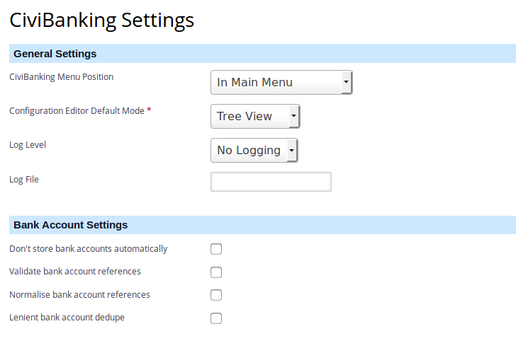

In the **Administration Console** you get a **CiviBanking Settings** option in
the **CiviContribute** tab as you see in the screenshot below:

If you select this option you will see the CiviBanking Settings:

The extension provides the following general settings:

### General Settings

- *Statement User Interface*    
  CiviBanking underwent a major user interface renovation. The traditional user
  interface is being kept for legacy users and not being documented.
- *CiviBanking Menu Position*
- *Configuration Editor Default Mode*
- *Log Level*
- *Log File*

### Bank Account Settings

- *Don't store bank accounts automatically*
- *Normalise bank account references*
- *Validate bank account references*
- *Probability of contact matching based on bank account*
- *Lenient bank account dedupe*