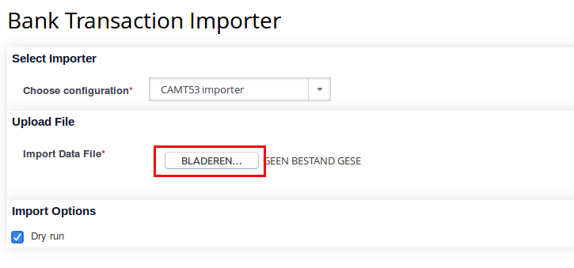

## Managing Bank Accounts

!!! note
    This section is yet to be completed.

    TODO: Add screenshots for each user interface aspect.

After installing CiviBanking you will get an additional tab on your **Contact
Summary** for **Bank Accounts**, which holds a table of bank accounts that
correspond to logical bank accounts for a contact.

### Bank Accounts and Bank Account References

A _Bank Account_ is a CiviBanking entity representing a real bank account (or
similar account, e.g. a PayPal account), which is accessible with a number of
_Bank Account References_. This separation allows different bank account
identifiers be used for the same real bank account, such as IBAN/BIC and
national account number/bank code, which may still be used in the SEPA area.

The table in the **Bank Accounts** tab shows a bank account in each row, divided
into a column with bank account references, another column with bank information
and buttons for editing and deleting the bank account.

Adding/Removing bank account references can be done using the `[+]`/`[-]` signs
in the bank account reference column of each row. There are several pre-defined
bank account reference formats shipped with CiviBanking. Adding more formats
requires adding code to the extension, so open an
[issue](https://github.com/project60/org.project60.banking/issues) or provide a
[Pull Request](https://github.com/project60/org.project60.banking/pulls) when
the format you require is not there.

It is advisable to record your organization's own bank accounts as CiviBanking
Bank Account entities in order for imported/processed CiviBanking statements to
be linked to your bank account, which greatly improves keeping track of bank
statements in the long turn, especially when you are using CiviBanking for
processing statements of multiple bank accounts. In order to do so, create the
bank accounts for your default Organization (usually contact ID 1) via the
*CiviBanking* tab, preferably prior to starting to use CiviBanking.

## Processing Bank Statements

Technically speaking, there are 3 (4) steps in the CiviBanking process when
reading and processing payments:

1. Importing
2. Analysing
3. Matching
4. Postprocessing (not always present)

The **first step (Importing)** is translating the data from the original format
to the basic generic format that CiviBanking understands. Since there are many
standards for such bank statement file formats, each bank adds their own
flavours, especially when outside the Single European Payment Area (SEPA), and
CiviBanking can process payment reports from other payment services, there has
to be an import plugin for each distinct file format configured to be processed
by CiviBanking.

See the [Importing Statements](#importing-statements) section for detailed
information on how to import bank statements and the
[Viewing Statements](#viewing-statements) section for detailed information on
how to list and view imported bank transaction statements.

The **second step (Analysing)** reads the transactions from the statement file
and checks what it can find and do related to your CiviCRM installation. For
example:

* the payment could be linked to a certain contribution (will be the most common
  case)
* no contribution but a contact with the same name and bank account exists,
  and a new contribution should be created
* no contribution but a contact already exists with the same name, but without a
  bank account, and a new contribution should be created
* the payment has nothing to do with CiviCRM
* etc.

For each scenario, there will be analyser plugins for preparing data, and match
plugins for creating suggestions on how to process the transaction. Each
suggestion will be rated based on how confident CiviBanking is about each
scenario, e.g. a donation should be assigned to a campaign and will be downrated
if no matching campaign can be found.

See the [Reviewing Statements](#reviewing-statements) section for detailed
information on how to analyse and review bank statement transactions.

In the **third step (Matching)**, you pick one of the suggestions from the
analyzing step and process the transaction. Each match plugin can be configured
to do that automatically, when certain preconditions are met, e.g. SEPA Direct
Debit transactions that already exist in CiviCRM can be automatically set to
"Completed" when they can be unambiguously identified.

See the [Processing Statements](#processing-statements) section for detailed
information on how to match and process bank statement transactions.

!!!note
    Analyser and matcher plugins can actually be mixed in this step. This is
    useful for when a transaction can already be reconciled after some basic
    analysis, so that a matcher can be configured to chime when there should be
    enough information for it to create a suggestion, without further analysing
    the transaction (which might be expensive performance-wise).

There may be a **fourth step (Postprocessing)** when post processing plugins
have been configured in CiviBanking. This would involve additional tasks to do
after transactions have already been processed as CiviCRM contributions, e.g.
extending a corresponding membership or creating an activity for an address
mismatch. This step does not involve any user interaction and will be performed
automatically during processing the selected suggestion.

### Importing Statements

Once an importer plugin is being set up, bank statements can be imported using
the *Import statements* which is accessible in the CiviBanking menu.

First, select an importer plugin (e.g. an *CAMT.053 XML* or a *CSV* importer)
appropriate for your statement file, then select the file to upload and hit
*Import*.

The importer will process the file as configured in the importer plugin. The
results being shown are dependent on the importer plugin configuration. Usually,
each processed transaction will be logged with its result, either success or
error. At the bottom of the import result page, buttons are placed for importing
again, and for reviewing the imported statement.

### Viewing Statements

From the CiviBanking menu, the *Show Statements* menu entry will lead to an
overview of all imported statements, showing the following information:

- *Start Date* - Date of first transaction in the statement
- *End Date* - Date of last transaction in the statement
- *Account* - Bank account the statement was created for
- *Amount* - Total amount of transactions in the statement
- *Reference* - Identifier of the statements
- *Sequence* - Sequential number of the statement, if applicable
- *Transactions* - Number of transactions in the statement, itemized by their
  current status:
    - *New* - Transactions that have not been analysed after importing
    - *Analysed* - Transactions that have already been analysed after importing
    - *Processed* - Transactions that have been successfully processed
    - *Ignored* - Transactions that have been ignored, i.e. not processed

For each statement, the following operations can be selected:

- *Review Statement*
- *List Lines*
- *Delete Statement*

When selecting *List Lines*, all transactions in the statement are being listed
with their key information in a table view:

- *Date*
- *Amount*
- *Purpose*
- *Account holder*
- *Status* (see status list above)

For each transaction, the following operations can be selected:

- *Review Transaction*
- *Delete Transaction*

### Reviewing Statements

When selecting to either review the complete statement or a single transaction,
the CiviBanking review screen will be loaded for analysing and processing the
statement's transactions one by one. The view is subdivided into the following
sections:

- *Basic Information* - Shows information directly extracted from the imported
  statement for each transaction, such as the amount, the booking and value
  date
- *Transaction Information* - Shows information about the (internal) transaction
  object: the statement and transaction number andits current processing state
- *Debitor Information* - Shows infomration about the holder of the account the
  transaction is originating from, including their account reference, name, and
  address - given that data has been imported from the statement
- *Details* - Shows (mostly) internal information that CiviBanking has extracted
  from the transaction, either during import or analysis. This section's content
  is dependent on the configured plugins and holds all data fields being stored
  with the transaction. Usually, this section is not relevant to the end user,
  and is thus being collapsed by default.

Below the transaction information, buttons are being placed for navigating
between transactions in the current statement, and for analysing and processing
them.

The review process is divided into the following status:

1. *New* - This is the initial status for each transaction, after it has been
   imported. The status indicates, that no analysis has been done yet and that
   it can be processed according to the plugin configuration.
2. *Analysed* - This is the status for transactions that have (at least once)
   been analysed, but not yet processed. Transactions within this state can be
   re-analysed again or processed according to the plugin configuration.
3. *Processed* or *Ignored* -  This status indicates that the transaction has
   been successfully processed or ignored as not being relevant, according to
   the plugin configuration.

Transactions in the *Analysed* state will be provided with suggestions as to how
they can be processed. The suggestions are dependent on the plugin
configuration. Usually, there will be at least a suggestion to enter the
transaction manually as contributions for a contact, as well as a suggestion to
ignore the transaction (when it should not be entered as a CiviCRM contribution
record). Match plugins can provide additional suggestions for the end user to
simply select one without having to further set contribution fields.

Generating suggestions depends on CiviBanking being able to identify a CiviCRM
contact for the account holder. This will be the case when either a contact has
the bank account set as a Bank Account entity, or when a plugin is configured to
try to identify a contact by the account holder name. This may yield either a
distinct result, or mutliple contacts (when there are similar names or
duplicates), or no contact at all (when the contact exists with a differing or
without a name, or does not exist at all). Changes to contacts made after
analysing the transaction or newly created ones will be considered when
re-analysing the transaction.

Each suggestion is assigned a precentage threshold for indicating how confident
CiviBanking was in suggesting what to do with the transaction. This is
configurable within each match plugin and should be based on empiricial values,
enabling the end user to trust these thresholds and be able to just select the
most reliable suggestion for processing the transaction.

#### Examples

1. Given a transaction being a donation for a specific campaign, CiviBanking
   could be configured to suggest entering it as a contribution of the type "
   Donation", associated with the CiviCRM campaign and adding some information
   in the *Source* field for the contribution.

2. Given a transaction being a membership fee payment, CiviBanking could be
   configured to suggest entering it as a contribution of the type
   "Membership Fee (Reduced)" or "Membership Fee (Regular)", depending on the
   amount, and extending the membership afterwards.

3. Given a transaction being a SEPA Direct Debit payment, CiviBanking could be
   configured to identify an existing contribution with the status "Pending",
   created for the SEPA mandate reference which can be found in the transaction
   purpose, and suggesting setting this contribution to "Completed" to mark the
   SEPA payment as successful. Alternatively, for return debits for failed SEPA
   debits, CiviBanking could be configured to suggest processing it by setting
   the contribution status to "Cancelled" and adding a cancel reason given in
   the transaction purpose.

#### Manual reconciliation

A special suggestion provided by the _Default Matcher_ is for manual
reconciliation, allowing the user to manually select a contact and one or more
contributions, or create new contributions, and add them to the suggestion. This
is useful for scenarios that are not implemented as "automatic" suggestions or
for edge cases.

!!! note
    This section is yet to be completed.

### Processing Statements

Once a suggestion has been selected, hitting *Confirm* will process it  with the
plugin configuration that provided the suggestion. This is dependent on the
plugin type and configuration, but will usually create or update a CiviCRM
contribution for the identified contact.

When there are post processor plugins set up in the plugin configuration,
additional actions might be performed with the contribution afterwards, e.g.
extending a corresponding membership, updating the contact's address, or setting
the contact's deceased status.

Each transaction that has been processed (or ignored) will be displayed with an
information text on what has been done with it. This is dependent on the type
and configuration of the plugin that was responsible for processing, but will
usually display a link to the contribution(s) and the contact, and denote which
contact/user processed it.

Match plugins can be configured to process transactions automatically, when
certain conditions are met, e.g. a threshold of a specific percentage, or a
campaign ID being present in the transaction purpose, etc. This is useful for
regular transactions that can certainly be related to a specific scenario, e.g.
SEPA Direct Debit payments, that do not need manual analysis. When a suggestion
is being created with the option to be automatically executed, the transaction
is being processed without showing the analysis screen to the end user, i.e.
when selecting *Review Statement* or *Review Transaction* on the overview pages,
only transactions that can not be processed automatically will be shown for
manual reconciliation.

## CiviBanking Dashboard

CiviBanking provides a dashboard view accessible in the CiviBanking navigation
menu, showing an overview of imported/processed bank statements per account and
statistics for the current and previous calendar year, and in total, grouped by
transaction status (New, Suggestions, Processed, Ignored).

This overview is useful for checking with transactions pending to be reviewed or
processed, reminding you to complete these tasks, so that your CiviCRM database
is up-to-date with your bank account statements.
