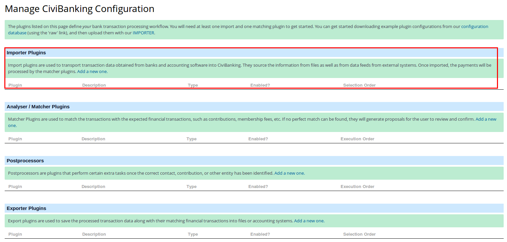

Configuring CiviBanking is a bit of a job. As it is pretty powerful and can
handle different types of files, it also needs configuration for each file. And
as you are importing files from specific formats it also requires quite some
technical knowledge to understand all the steps required.

!!! note "What if I want to know more?"
    Please note that this chapter does not mention all possibilities or options.
    CiviBanking is very powerful and flexible, trying to write a guide that
    mentions all possibilities would be a massive task. The amibition of this
    section is to give you an example configuration and explain the concepts. If
    you have specific needs or additional questions please contact an expert to
    discuss what is possible? It might well be that you have read this chapter
    and think this is a far too daunting step for you to take. If that is the
    case, please contact a CiviCRM expert to help you. You can find CiviCRM
    experts on the Find an Expert page on the
    [CiviCRM website](https://civicrm.org/partners-contributors).

As denoted in the [User Guide](../../user-guide.md), processing bank statements
is divided into 4 steps:

1. Importing
2. Analysing
3. Matching
4. Postprocessing

Each step is being taken care of by CiviBanking Plugins of the respective type.
Plugins can be installed or imported with the **Banking>Configuration Manager**,
which is accessible in the CiviBanking navigation menu. The first time you
access the Configuration Manager you will probably get a form like this:

For creating a new plugin instance, click on the **add a new one** link.
Alternatively, if you have a plugin configuration (including importers, matchers
and so on) for CiviBanking from another CiviCRM installation, you can use the **
IMPORTER** link to select an exported configuration file and import that into
your new CiviBanking installation. There are quite some examples in the
[Configuration Example Database](https://github.com/Project60/org.project60.banking/tree/master/configuration_database)

You will need to configure at least one importer and some matchers.

We will look into each step in some more detail in the following sections from a
configuration point of view.

For this documentation section we assume you have accepted all the defaults in
the CiviBanking [Extension Settings](../settings.md).

## Importing

**Importing** is about translating the data provided by the payment processor (
bank files, csv files etc.) into the CiviBanking speak.

There can be many files containing payments that you would like to have
processed like:

* the payment transactions in your bank account that you can get from the bank,
  e.g. in CAMT53 format (a format used by a lot of Western European Banks)
* credit card payments that you get from the credit card company
* PayPal payments which you can download from the PayPal website
* SMS payments that you can get from your SMS provider
* etc. etc.

You will need to configure Importer Plugins in CiviBanking for each type of file
you want to import.

CiviBanking ships with the following importer plugins:

* **Configurable CSV Importer** - a configurable plugin to import any CSV based
  data.
* **Configurable XML Importer** - a configurable plugin to import a variety of
  XML based data
* **Fixed Width TXT Importer** - a configurable plugin for most fixed-width txt
  standards
* **Dummy Data Importer Plugin** - For testing purposes only

## Analyzing

The process of **Analyzing** tries to interpret and enrich the imported data to
be able to provide suggestions for what to do with the transaction. Analyzing
could be checking if there is an IBAN (International Bank Account Number) in the
data and if so, use that to match it with a contact in CiviRM that has that IBAN
registered as a _Bank Account_ entity.

To be able to do that you will need to configure _Analyser_ and _Matcher
Plugins_. These are configurable parts that tell CiviBanking how to analyse part
of the data, or how to match the transaction. It could also tell CiviBanking to
ignore certain transactions etc. All these kinds of plugins will have the
**plugin class** _Matcher_ and different **implementations** doing things like
analysing, matching or ignoring.

A configuration of CiviBanking will have some of these by default, but during
the implementation process you will probably need to configure a few more.

In the subsections below we will explain what the different **implementations**
are and mean, and give you some examples for implementations. This should give
you a first idea of what is required. If you want to know more about creating
your own plugins of the **Matcher** class,
see [How to create a matcher](analyser-matcher.md).

Here is a comprehensive list of the different implementation types of
Analyser Plugins with a short sentence on what they can do. In the subsections
you will see some examples of the ones that are most commonly used.

* **RegEx Analyser** - this plugin will try to find a certain pattern specified
  in a Regular Expression (check
  [here](https://en.wikipedia.org/wiki/Regular_expression)) for more about
  Regular Expressions) and is then able to do something or enrich the data of
  the transaction
* **Account Lookup Analyser** - this plugin will be switched on by default and
  enables a match based on bank account

## Matching

**Matching** is the process of taking data from the transaction, possibly
adjusted by Analyser plugins, and providing suggestions for how to process it.
Each Matcher plugin has its own definition of required or optional parameters
to pass in and will create one or more suggestions based on them.

Here is a comprehensive list of the different implementation types of
Matcher Plugins with a short sentence on what they can do. In the subsections
you will see some examples of the ones that are most commonly used.

* **Default Options Matcher** - a plugin that will be installed by default and
  provides the default suggestions _process manually_ or _ignore in CiviCRM_
* **Create Contribution Matcher** - a plugin that will create a contribution
  based on specific matches
* **Contribution Matcher** - a plugin that will try to find a pending
  contribution matching the payment and set it to completed
* **Recurring Contribution Matcher** - a plugin that will try to find a
  recurring contribution for the payment and create an installment (a linked
  completed contribution)
* **SEPA Matcher** - a plugin that will try to find a SEPA mandate and record
  the payment as installment (find a pending contribution and set it to
  completed)
* **Membership Matcher** - a plugin that will try to find a membership and
  record the payment as a membership payment for this membership
* **Ignore Matcher** - a matcher that will ignore payments that match the
  criteria (for payments that do not have to be in CiviCRM)
* **Batch Matcher** - a matcher that will try to find the financial batch in
  CiviCRM and (if it is one big payment) distribute it over the entities in the
  batch. At least, that is the theory, we know of no installation that uses this
  plugin.
* **Dummy Matcher Test Plugin** - is there for testing purposes, not really
  usable in real life

## Postprocessing

**Postprocessing** is being done by plugins that perform certain extra tasks
once the correct contact, contribution, or other entity has been identified.
These plugins do not create suggestions and will act on each processed match
when their preconditions apply, i.e. the user will not have the ability to
decide whether a post processor plugin should be run on the result, or not.

This is useful for automating tasks that are related with processing
contributions, such as extending memberships, updating differing addresses,
setting contacts' deceased status, etc.

CiviBanking ship swith the following Postprocessor plugins:

* **Bank Accounts PostProcessor** - Allows you to store the bank accounts with
  the contact or contribution
* **Update Address PostProcessor** - Updates a contact's address with the one
  from the transaction
* **MembershipPayment PostProcessor** - Assigns newly created contributions to
  memberships
* **API PostProcessor** - Triggers any API action
* **Contact Deceased PostProcessor** - Marks a contact as "deceased"
* **Recurring Contribution Fails PostProcessor** - Processes contribution fails
  and cancellations for recurring contributions, including CiviSEPA DDs
* **Membership Extension PostProcessor** - Will automatically extend memberships
  if the right contribution is processed

## Examples

There are example configurations for each plugin type in
the [Configuration Example Database](https://github.com/Project60/org.project60.banking/tree/master/configuration_database)
.
