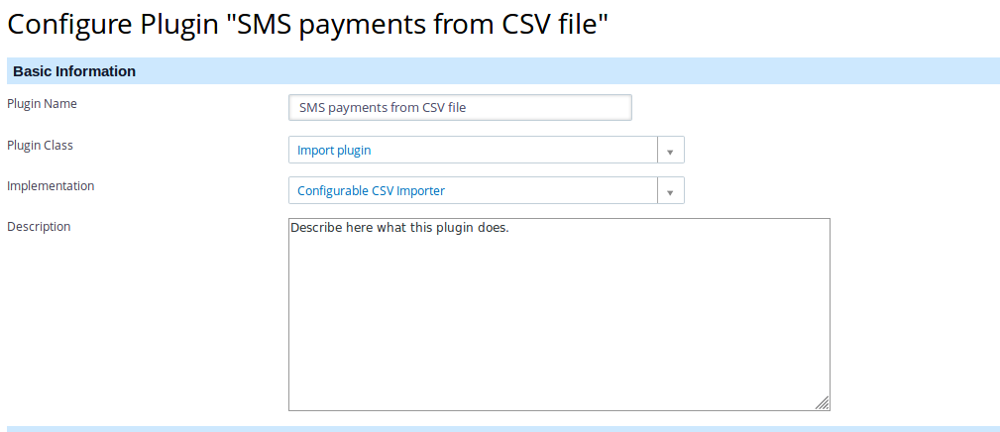
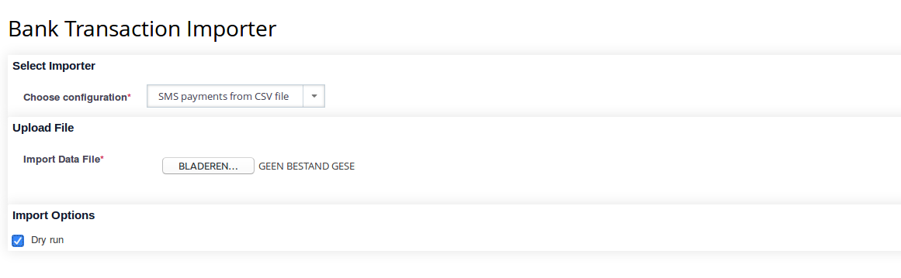

!!! note
    This section is yet to be completed.

Having clicked the **add a new one** link in the **Configuration Manager** page,
on the next form, enter a _name_ for the plugin, and select the **Import
Plugin** as the _class_. This example importer is meant to import SMS payments
from a CSV file, so select **Configurable CSV importer** as _Implementation_,
and enter a few sentences describing what the imported does at _description_.
The result will be in the top half of the Configuration Manager Add Plugin
screen and will look something like this screenshot:



In the bottom half, enter the technical information required for the plugin to
interpret the incoming file and know which field in the incoming file to send to
which field in the CiviBanking transaction.

This kind of information is entered in [JSON](https://www.json.org/). For the
CSV we have an example configuration (from a project where this worked for their
SMS payments which they download as a CSV file which should serve as an example.

You can copy the JSON data below and paste it in the bottom half of the
Configuration Manager Add Plugin form (the part marked with **Configuration**).
Once all the data is entered, press the **Save** button to save your plugin
configuration.

``` json
{
  "delimiter": ";",
  "header": 1,
  "title": "SMS {starting_date} - {ending_date}",
  "defaults": {
    "sms_contact_id": 2314,
    "financial_type_id": 1,
    "payment_instrument_id": 7
  },
  "line_filter": "#(Bedankt voor jouw donatie aan Stichting Voorbeeld)|(\"Status\",Direction,Processed.*)#",
  "filter": [
    {
      "type": "string_positive",
      "value1": "_constant:Delivered",
      "value2": 0
    }
  ],
  "rules": [
    {
      "from": "Processed",
      "to": "booking_date",
      "type": "set"
    },
    {
      "from": "Processed",
      "to": "value_date",
      "type": "set"
    },
    {
      "from": "Message",
      "to": "purpose",
      "type": "set"
    },
    {
      "from": "Cost",
      "to": "amount",
      "type": "replace:€ :"
    },
    {
      "from": "amount",
      "to": "amount",
      "type": "amount"
    }
  ]
}
```

!!! note
    The _payment_instrument_id_ is really important and should be configured
    correctly. This means that the ID should exists in your database and reflect
    the payment instrument you want to use for the incoming transactions, for
    example SMS payment.

## Test configuration

Once you have completed the configuration of your CSV importer, you should
test if it actually works!

You can do this by importing a file with **Import Transactions** in the
CiviBanking navigation menu. Selecting this from the menu will bring up a form
like the screenshot:



Select **SMS Payments from CSV file** as the _configuration_ and set the
_Dry run_ option to **Yes**, so it does not actually import the file, but just
tells you if it _could_ import the file. Select the CAMT53 file you want to test
with in the **Import Data File** field.
